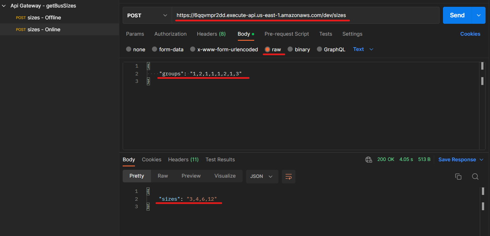

# **Prueba Técnica - Banco de Occidente**

## **Problema a Resolver**

Usando una función **AWS Lambda** ***(hecha en Java o Node.js)*** la cual se debe exponer como **Api REST** a través del servicio **AWS Api Gateway**, resuelva el siguiente problema:

Hay ${n}$ grupos de amigos y cada grupo es numerado de ${1}$ a ${n}$. El ${n}$ grupo contiene ${a_i}$ personas.

Todos viven cerca de una parada de bus, y solo un bus funciona en esa ruta. El bus vacío llega a la parada y todos los grupos quieren viajar en ese bus. Sin embargo, cada grupo de amigos no quiere separarse. Así que entran al bus solo si el bus puede llevar a todo el grupo.

Además, los grupos no quieren cambiar su posición relativa mientras viajan. En otras palabras, el grupo 3 no puede viajar en el bus, a menos que el grupo 1 y el grupo 2 ya hayan viajado, adicionalmente es necesario que todos estén sentados dentro del autobús en este momento, lo que quiere decir que un bus de capacidad ${x}$ solo puede transportar ${x}$ personas simultáneamente.

Encuentre todos los posibles tamaños de ${x}$ del bus para que pueda transportar a todos los grupos, cumpliendo con las condiciones anteriores, y cada vez que el bus salga de la estación, no haya sillas vacías en el bus (es decir, el número total de personas presentes dentro del bus es igual a ${x}$)

**Ejemplo de un Request:**

```json
{
    "groups":"1,2,1,1,1,2,1,3"
}
```

**Ejemplo de un Response:**

```json
{
    "sizes":"3,4,6,12"
}
```

Para el ejemplo de **Request** y **Response** anterior, la lógica usada es la siguiente:

- Se tiene como entrada los grupos ${a_1} = 1$, ${a_2} = 2$, ${a_3} = 1$, ${a_4} = 1$, ${a_5} = 1$, ${a_6} = 2$, ${a_7} = 1$, ${a_8} = 3$

- Si ${x} = 1$, en el primer viaje ${a_1}$ va en el bus, sin embargo, no puede hacer un segundo viaje, porque el grupo ${a_2}$ tiene 2 personas y el bus una capacidad para una. De acuerdo con lo anterior, el valor ${x} = 1$ no puede hacer parte de la respuesta.
  
- Si ${x} = 2$, no será posible hacer el primer viaje, porque tendría que transportar a los grupos ${a_1}$ y ${a_2}$ como mínimo, y solo tiene capacidad para 2 personas, y si solo transporta al grupo ${a_1}$ entonces quedaría una silla vacía. De acuerdo con lo anterior, el valor ${x} = 2$ no puede hacer parte de la respuesta.

- Si ${x} = 3$, el primer viaje sería con los grupos ${a_1}$ y ${a_2}$, el segundo viaje con ${a_3}$, ${a_4}$ y ${a_5}$, el tercer viaje con ${a_6}$ y ${a_7}$ y finalmente el cuarto viaje lo hace con el grupo ${a_8}$. De acuerdo con esto, ${x} = 3$ sí es una posible respuesta y debe ir como parte de la salida del servicio **REST**.

- Sí ${x} = 4$, el primer viaje será con los grupos con ${a_1}$, ${a_2}$ y ${a_3}$, el segundo viaje será con ${a_4}$, ${a_5}$ y ${a_6}$ y finalmente el tercer viaje será con ${a_7}$ y ${a_8}$. Por lo tanto ${x} = 4$ también hace parte de la respuesta.

- Así sucesivamente se deben evaluar las demás posibles opciones para ${x}$. Que en el ejemplo dado la respuesta debe ser **3,4,6,12** como posibles valores de ${x}$.

**Para tener en cuenta**

- La solución debe entregarse el día y hora indicada, enviando vía email un enlace al repositorio público donde se encuentra la solución (En el repositorio queda registrada la última modificación que no debe ser posterior a la fecha de entrega). Puede usar usar el controlador de versiones de preferencia (**GitHub, GitLab, etc**).

- Para sustentar la solución debe presentar el código fuente en el IDE de su preferencia y la prueba del servicio usando Postman, cuando le sea programada la presentación. El servicio debe estar operando correctamente en el **API Gateway**.

- Para la implementación en **AWS** puede crear una cuenta personal *(esta implementación no genera costos porque los servicios hacen parte de la capa gratuita que dura un año)*.

---

## **Propuesta de Solución**

- En primer lugar, se deben evaluar todas las posibles opciones de ${x}$ en un rango, ese rango sería: desde ${1}$ **(Capacidad mínima de personas del Bus)** hasta el **total de personas** de todos los grupos.
  
- Partiendo de ese rango, es importante validar que el posible valor ${x}$ sea divisor del número total de personas, de lo contrario, no podría transportarlos a todos sin que queden sillas vacías, por ejemplo: si tomamos a ${x}=5$ para el caso dado donde el total de personas es ${12}$ el bus realizaría 2 viajes (${10}$ personas) y quedarían ${2}$ personas pendientes con ${3}$ sillas vacías.
  
- Ya teniendo un valor ${x}$ (***por ahora válido***), se debe evaluar si puede llevar a todos los grupos sin perder su posición relativa, ${x}$ debe validarse con cada grupo para que al final del viaje (***siendo un viaje ${z}$ grupos transportados***) transporte (***sin perder la posición relativa de los grupos***) todas las personas y no queden sillas vacías.

---

## **Implementación**

**Función stringToArrayNumbers**

Recibe como parámetro un string **(siendo este el Request; los grupos)**

La función expuesta separa cada número presente en la cadena string delimitada por `(,)` y crea un arreglo de número enteros, siendo este su retorno directo.

```js
function stringToArrayNumbers(string){
    return string.split(",").map((number) => parseInt(number, 10));
}
```

**Función sumArray**

Recibe como parámetro un array **(siendo este array los grupos)**

La función expuesta hace una sumatoria de los valores del array, siendo este su retorno directo. ***(donde el retorno equivale al total de personas presentes)***

```js
function sumArray(array) {
  return array.reduce((acc, val) => acc + val, 0);
}
```

**Función canTransport**

Recibe como parámetros:

- Los grupos `[head, ...tail]`, en este caso, haciendo un *destructuring* directo (extrayendo su cabeza y cola).
- El tamaño del bus `busSize` (siendo este tamaño el posible valor ${x}$)

La función expuesta toma como base `busSize` para ser evaluado por todos los grupos y hace una serie de validaciones para comprobar si realmente puede transportar a todos los grupos sin perder su posición relativa.

- Recorre todos los grupos y por cada grupo acumula el total de personas presentes en dichos grupos ***(acá se garantiza que ningún grupo se separe, es decir, el grupo se transporta completo)***

- Se evalúa si el número de personas de los grupos **(de acuerdo a cada iteración)** no supera la capacidad del bus **(posible valor de ${x}$)**

    - Si el número de personas de los grupos se excede respecto a la capacidad del bus, significa que el grupo actual no puede ser transportado, por ende, no es un valor posible para ${x}$, ya que con el grupo anterior se hizo lo siguiente:

        - Si el número de personas de los grupos es igual a la capacidad de bus, significa que se puede realizar un viaje, y se deben evaluar los siguientes.
        - Ahora bien si aún faltan personas, pasa al siguiente grupo para evaluar si puede ser transportado.

> Nota: Este recorrido garantiza la posición relativa de los grupos, garantiza que cada grupo viaje completo **(sin separarse)** y lo más importante: el bus no puede quedar con sillas vacías.

La función retorna un valor boolean, `true` si ${x}$ es una posible solución y `false` si no lo es.

```js
function canTransport([head, ...tail], busSize) {
  let sum = head;
  for (let i = 0; i < tail.length; i++) {
    sum += tail[i];
    if (sum > busSize) {
      // The current group cannot be transported without changing its relative position
      return false;
    } else if (sum === busSize) {
      sum = 0;
    }
  }
  return true;
}
```

**Función getBusSizes**

Recibe como parámetro los grupos a evaluar en cuestión los posibles valores de ${x}$

Siendo `getBusSizes` la función principal, realiza una serie de pasos:

- Convierte la entrada (`groups`) a un arreglo de enteros, gracias a la función `stringToArrayNumbers`
- Se calcula el total de personas de los grupos, gracias a la función `sumArray`
- Acá se valida cada posible valor de ${x}$ de acuerdo al rango indicado ***(1 a Total de Personas)***
- Ya con cada posible valor de ${x}$ podemos tener en cuenta lo siguiente:
  - Evaluar si es divisor del total de personas, es decir, que pueda transportarlos a todos sin dejar sillas vacías.
  - Evaluar gracias a la función `canTransport` si puede transportar a todos los grupos sin perder su posición relativa, garantizando que cada grupo no se separe y nuevamente que no queden sillas vacías.

Si todo se cumple, quiere decir que ${x}$ hace parte de una posible solución.

Esta función retorna una cadena `string` con todos los posibles valores de ${x}$

```js
function getBusSizes(groups) {
  groups = stringToArrayNumbers(groups);
  const totalPeople = sumArray(groups);
  const sizes = [];

  for (let i = 1; i <= totalPeople; i++) {
    // If divisor of totalPeople is a valid option of x
    if (totalPeople % i === 0) {
      if (canTransport(groups, i)) {
        sizes.push(i);
      }
    }
  }
  // Array numbers to string
  return sizes.join(",");
}
```

---

## **Probando la solución**

Se ha creado un ENDPOINT POST alojado en API GateWay para el presente problema.

**URL:** https://6qqvmpr2dd.execute-api.us-east-1.amazonaws.com/dev/sizes

**Method:** POST

**Body:** raw



- Se envía el **Request** en formato **json**, donde los grupos corresponden a una cadena **string**
- Se recibe el **Response** en formato **json**, con los posibles valores de ${x}$ ***(que en efecto, son correctos, de acuerdo al ejemplo propuesto)*** en una cadena **string**


Siendo lo anterior, una posible solución al problema propuesto, cumpliendo con todos los requerimientos 💯✌️.


<br><br><br><br>

<br>**By**
<br>**Volkmar Carrillo**
<br>**Back-End Developer**